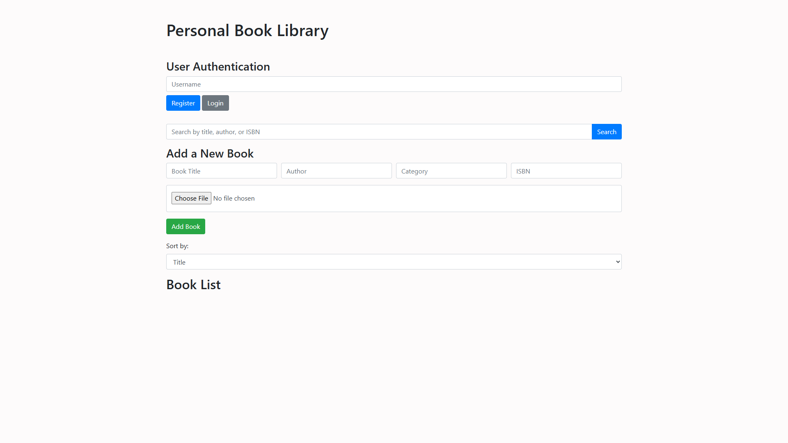

# 📚 Personal Book Library

A simple React app that allows users to manage their personal book collection. You can add, edit, and delete books from your library with an intuitive and responsive interface.

> 🔗 Featured on [LinkedIn Post](https://www.linkedin.com/posts/abd-el-rahman-adel-dev_javascript-html-css-activity-7246324245931147264-T0ir?utm_source=share&utm_medium=member_desktop&rcm=ACoAAEah8IkBjMk2EJi1EE6Ixmd0ZbtCvA9HqIg)

---

## 🚀 Live Demo

[🔗 View Live on GitHub Pages](https://abd-el-rahman-adel-dev.github.io/CodeAlpha_Tasks_BookLibrary)

## 📸 Screenshots

 <!-- You can upload your screenshot and update the file name -->

---

## ✨ Features

- 📖 Add new books (title, author, genre, year)
- 📝 Edit existing books
- ❌ Delete books
- 💡 Responsive design
- ⚛️ Built with React

---

## 🛠 Tech Stack

- **React.js** – UI library
- **CSS3** – Styling

---

## 📦 Installation

To run the project locally:

```bash
git clone https://github.com/abd-el-rahman-adel-dev/CodeAlpha_Tasks_BookLibrary.git
cd CodeAlpha_Tasks_BookLibrary
npm install
npm start
```

Or just double-click `index.html` in your file manager.

---

## 📁 Project Structure

```
📦 CodeAlpha_Tasks_BookLibrary
┣ 📂 public
┣ 📂 src
┃ ┣ 📂 components
┃ ┣ 📜 App.jsx
┃ ┣ 📜 index.js
┃ ┗ 📜 App.css
┗ 📜 package.json

```

---

## 📄 License

This project is licensed under the [MIT License](./LICENSE).

---

## 🙋‍♂️ Author

- [Abd El-Rahman Adel](https://github.com/abd-el-rahman-adel-dev)
- [LinkedIn](https://www.linkedin.com/in/abdelrahman-adel-webdev)

---

> ⭐ If you like this landing page, consider starring the repo and reusing the template for your own projects.
